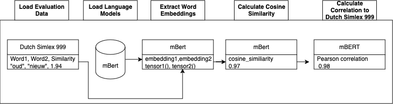

# Intrinsic Evaluation of Multi vs Monolingual Language Models in Dutch

This github repository hosts the code for the data science MSc thesis on the intrinsic evaluation of Mono- vs multilingual language models in Dutch.
It contains the code to encode the word pairs from Dutch-Simlex 999 in a number of language models, retrieve the cosine similarity between the encoded word pairs and interpret the results.



## Table of Contents

- [Installation](#installation)
- [Usage](#usage)

## Installation

To install requirements run 
```sh
pip install -r requirements.txt
```

This repo requires training data for finetuning the mBERT and XLM-RoBERTa language models. We use the SoNaR and CGN corpora, these can be downloaded from the web:


- [SoNaR](https://taalmaterialen.ivdnt.org/download/tstc-sonar-corpus/)
- [CGN](https://taalmaterialen.ivdnt.org/download/tstc-corpus-gesproken-nederlands/)


After downloading and extracting these corpora, place the folders in the root directory under the following names:

- <b>intrinsic_evaluation_thesis/SoNaRCorpus_NC_1.2<b>
- <b>intrinsic_evaluation_thesis/cgn<b>

## Usage

To create data subsets of the cgn and SoNaR corpora:
```sh
python scripts/extract_from_cgn.py
python scripts/extract_from_SoNaR.py
```

After these trianing data subsets have been created you can finetune the mBERT and XLM-RoBERTa models by running the finetune.py and finetune_roberta.py files. Change the training data filepaths in these scripts accordingly.

```sh
python scripts/finetune.py
python scripts/finetune_roberta.py
```

With the tuned models you can now evaluate. To generate the embeddings and interpret on a single language model use the run_evaluation script and use the argument --model to choose which language model to use. --model 1 to 4 contian the pretrained mBERT, bertje, robBERT, and XLM-RoBERTa models. -model 5 and 6 are used for finetuned models. Replace the model_path, tokenizer_path and model_name variables in these accordingly. Use the --eval_data argument to change the test set (located in evaluation_data folder). 

```sh
#example usage:
python scripts/run_evaluation2.py --model 2 --eval_data "evaluation_data/manual_compounds_0.txt"
```
After generating results per language model use interpret_results.py to generate visualisations and a summary.csv containg the aggregate and pos correlation scores, per layer for each model
```sh
python scripts/interpret_results.py
```

